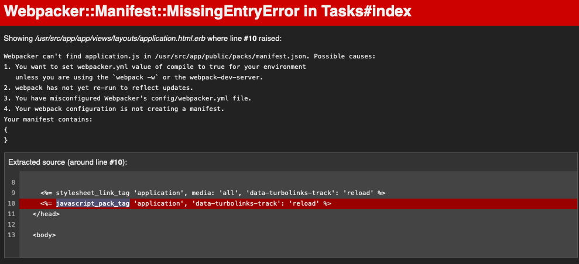

# JobSanとは
タスクを管理してくれるすごいやつ

# 環境構築

1. docker build
1. db migration
1. webpack compile(暫定)

## 1. Docker build

目的：サーバの構築

以下のコマンドを実行してください。

```
$ pwd
> ${リポジトリがある場所}/training/job_san
$ ls
> ... Dockerfile, docker-compose.yml
$ docker-compose up 
> webとdbとselenium_chromeが立ち上がったことを確認してください。
````

## 2. マイグレーション

目的：開発・テスト環境のデータベースのマイグレーション

```
$ docker-compose run web bundle exec rails db:create
> Created database 'job_san_test'
$ docker-compose run web bundle exec rake db:migrate
> 開発環境用のテーブルが生成される。
```

## 3. テーブルスキーマを戻す（暫定対応）

目的：自動で変更された差分を元に戻す

mysql2のバグのため、テーブル定義でutf8mb4のエスケープ文字が扱えないようです。
2で行った`rake db:migrate`でrailsによって自動で変更された差分を元に戻してください。

```
$ git diff
> job_san/db/schema.rb

$ git checkout job_san/db/schema.rb
> 自動で変更された内容を戻す 
```


## 4. webpackerのインストール（暫定対応）

目的：webpackerのインストール

以下のエラー画面が表示された際、この項目を行ってください。



webpackerのインストールが正しく行えていないです。

`rails new`のやり方がよくなかったっぽいです。余裕があったら直します。

以下のコマンドを実行してください。
```
$ docker-compose run web bundle exec rails webpacker:install
> Webpacker successfully installed
```

## 4. HELLO WORLD !

お疲れ様でした。 これで環境構築は終わりです。

サーバが立ち上がっていなければ、再度立ち上げてください。

```
$ docker-compose up
> web_1              | * Listening on http://0.0.0.0:3000

ブラウザにアクセスしてください。
```

# 確認方法

## 動作確認
`docker-compouse up` してサーバを立ち上げてから`http://localhost:3000` へアクセスして下さい。

## テスト実行
`docker-compose exec web bundle exec rspec`

## 注意事項

### 1. railsによるdbのマイグレーション関連
`ex: rake db:migrate:redo`

mysql側のバグ？で `utf8mb4のエスケープ文字を扱うことができません`。

railsで生成されたschemaファイルから`_utf8mb4\\'カラム名'\\`のエスケープしている部分を削除してください。（`git diff`で確認できます。）

参考: https://bugs.mysql.com/bug.php?id=100607
