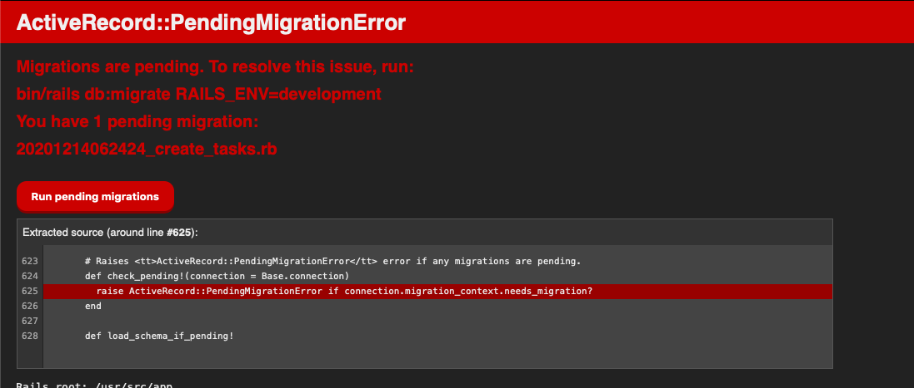

# JobSanとは
タスクを管理してくれるすごいやつ

# 環境構築

1. コマンド実行
```
$ pwd
> ${リポジトリがある場所}/training/job_san
$ ls
> ... Dockerfile, docker-compose.yml
$ docker-compose up 
> webとdbとselenium_chromeが立ち上がったことを確認してください。
````

2. マイグレーション
   
`docker-compose up` が終わったらブラウザから `http://localhost:3000` へアクセスして下さい。
画面上にマイグレーション用のボタンが出力されているのでクリックしてください。



3. HELLO WORLD !

# 確認方法

## 動作確認
`docker-compouse up` してサーバを立ち上げてから`http://localhost:3000` へアクセスして下さい。

## テスト実行
`docker-compose run web bundle exec rspec` 

