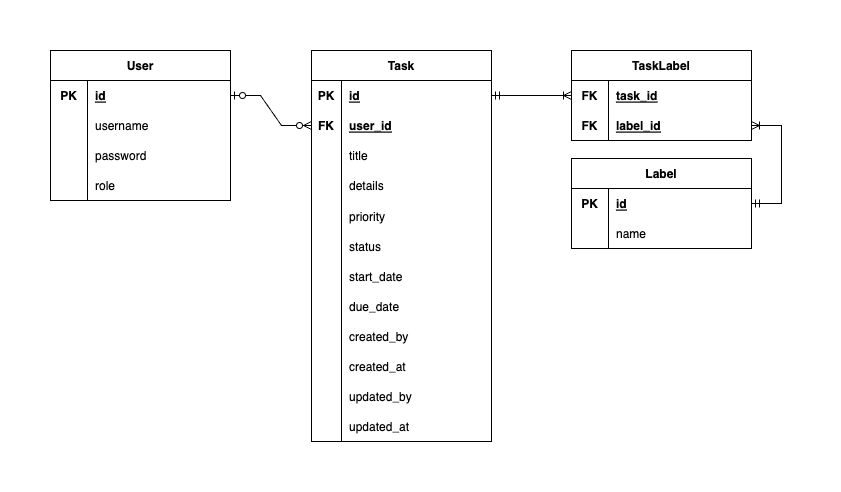
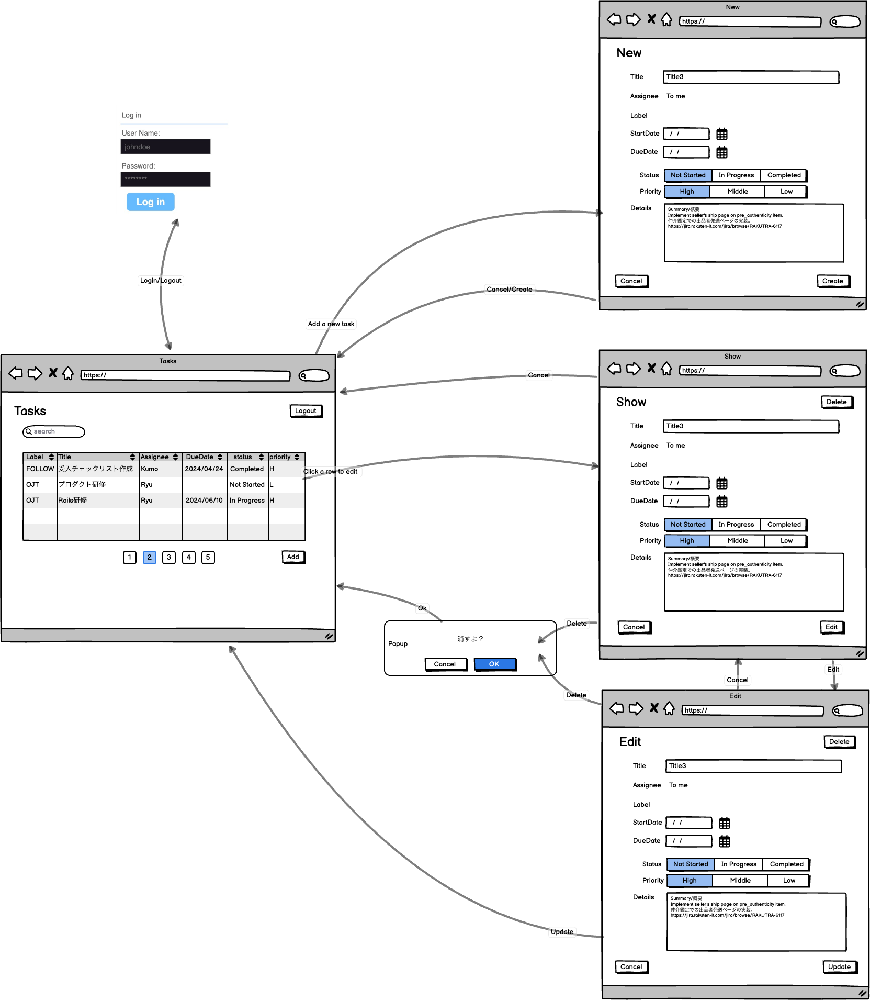

# README

* Ruby version
    - Ruby (3.2.1)
    - Ruby on Rails (7.0.8.1)
    - MySQL (8.4)
    - Docker Compose (2.27.0)

* TableSchema

    
        
    ### User
    | Column | DataType | Remarks |
    |:---|:---:|:---|
    | id | INT(11) | PK, Auto-increment |
    | username | VARCHAR(255) | unique |
    | password | VARCHAR(255) | hashed |
    | role | ENUM(TBD) | |

    ### Task
    | Column | DataType | Remarks |
    |:---|:---:|:---|
    | id | INT(11) | PK, Auto-increment |
    | title | VARCHAR(255) | |
    | details | TEXT | |
    | due_date | DATE | |
    | priority | ENUM('Low', 'Medium', 'High') | Default: 'Medium' |
    | status | ENUM('Not Started', 'In Progress', 'Completed') | Default: 'Not Started' |
    | user_id | INT(11) | FK->User(id) |
    | create_date | DATETIME | |
    | create_user | VARCHAR(255) | |
    | update_date | DATETIME | |
    | update_user | VARCHAR(255) | |

    ### Label
    | Column | DataType | Remarks |
    |:---|:---:|:---|
    | id | INT(11) | PK, Auto-increment |
    | name | VARCHAR(255) | |

    ### TableLabel
    | Column | DataType | Remarks |
    |:---|:---:|:---|
    | task_id | INT(11) | PK, FK->Task(id) |
    | label_id | INT(11) | PK, FK->Label(id) |
        

* Wireframe
    
    

