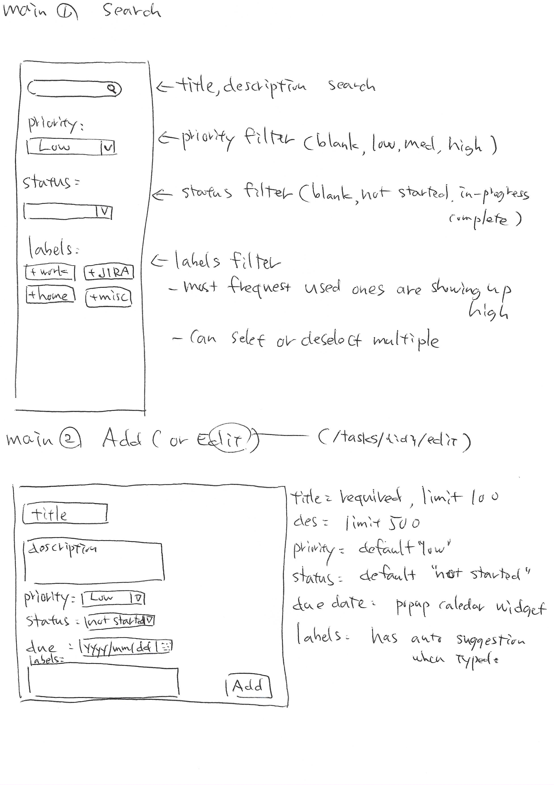

# README

[Hand writting drafts](./docs/draft/README.md)

[DB docs](./docs/schema/README.md)

----------------------------
This README would normally document whatever steps are necessary to get the
application up and running.

Things you may want to cover:

* Ruby version

* System dependencies

* Configuration

* Database creation

* Database initialization

* How to run the test suite

* Services (job queues, cache servers, search engines, etc.)

* Deployment instructions

* ...
