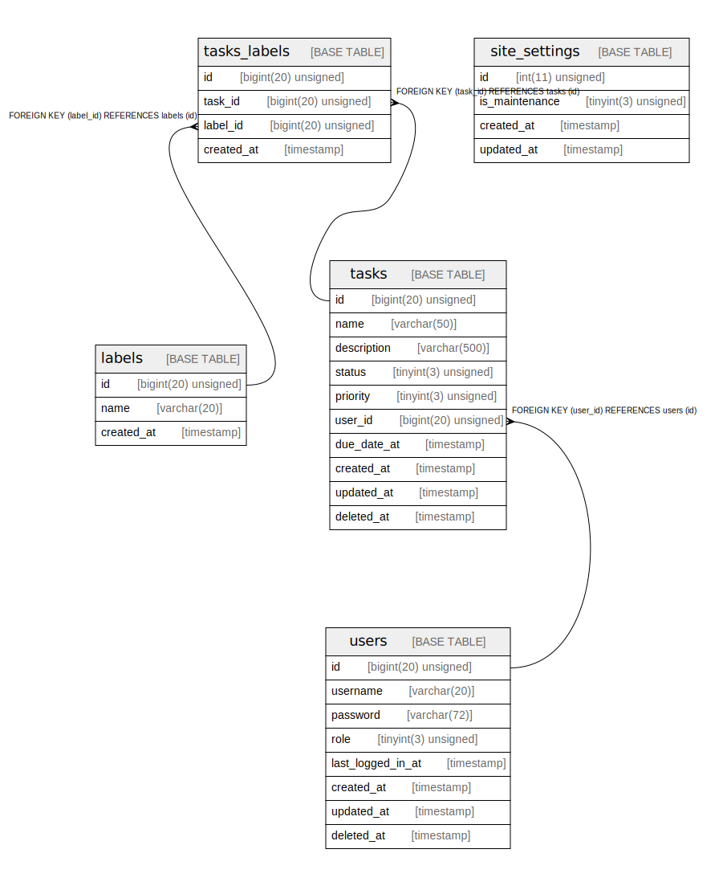

# myapp_draft

DB docs for the myapp draft version.
The schemas are designged as general RDMS standard and for the requirements. It is not considered as Rails best practice. So it would be revised while training proceeds.

## Tables

| Name | Columns | Comment | Type |
| ---- | ------- | ------- | ---- |
| [labels](labels.md) | 3 |  | BASE TABLE |
| [site_settings](site_settings.md) | 4 |  | BASE TABLE |
| [tasks](tasks.md) | 10 |  | BASE TABLE |
| [tasks_labels](tasks_labels.md) | 4 |  | BASE TABLE |
| [users](users.md) | 7 |  | BASE TABLE |

## Relations

---

> Generated by [tbls](https://github.com/k1LoW/tbls)
