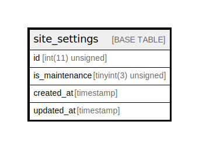

# site_settings

## Description

<details>
<summary><strong>Table Definition</strong></summary>

```sql
CREATE TABLE `site_settings` (
  `id` int(11) unsigned NOT NULL AUTO_INCREMENT,
  `is_maintenance` tinyint(3) unsigned DEFAULT '0' COMMENT '0 = off, 1 = on',
  `created_at` timestamp NOT NULL DEFAULT CURRENT_TIMESTAMP,
  `updated_at` timestamp NOT NULL DEFAULT CURRENT_TIMESTAMP ON UPDATE CURRENT_TIMESTAMP,
  PRIMARY KEY (`id`)
) ENGINE=InnoDB DEFAULT CHARSET=utf8mb4 COLLATE=utf8mb4_unicode_ci
```

</details>

## Columns

| Name | Type | Default | Nullable | Extra Definition | Children | Parents | Comment |
| ---- | ---- | ------- | -------- | ---------------- | -------- | ------- | ------- |
| id | int(11) unsigned |  | false | auto_increment |  |  |  |
| is_maintenance | tinyint(3) unsigned | 0 | true |  |  |  | 0 = off, 1 = on |
| created_at | timestamp | CURRENT_TIMESTAMP | false |  |  |  |  |
| updated_at | timestamp | CURRENT_TIMESTAMP | false | on update CURRENT_TIMESTAMP |  |  |  |

## Constraints

| Name | Type | Definition |
| ---- | ---- | ---------- |
| PRIMARY | PRIMARY KEY | PRIMARY KEY (id) |

## Indexes

| Name | Definition |
| ---- | ---------- |
| PRIMARY | PRIMARY KEY (id) USING BTREE |

## Relations



---

> Generated by [tbls](https://github.com/k1LoW/tbls)
