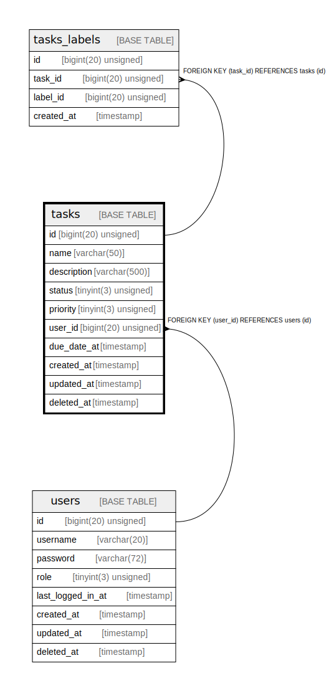

# tasks

## Description

<details>
<summary><strong>Table Definition</strong></summary>

```sql
CREATE TABLE `tasks` (
  `id` bigint(20) unsigned NOT NULL AUTO_INCREMENT,
  `name` varchar(50) COLLATE utf8mb4_unicode_ci NOT NULL DEFAULT '',
  `description` varchar(500) COLLATE utf8mb4_unicode_ci DEFAULT NULL,
  `status` tinyint(3) unsigned NOT NULL DEFAULT '0' COMMENT '0 = not yet started, 1 = completed, 2 = in-progress',
  `priority` tinyint(3) unsigned NOT NULL DEFAULT '0' COMMENT '0 = low, 1 = med, 2 = high',
  `user_id` bigint(20) unsigned NOT NULL DEFAULT '0',
  `due_date_at` timestamp NULL DEFAULT NULL,
  `created_at` timestamp NOT NULL DEFAULT CURRENT_TIMESTAMP,
  `updated_at` timestamp NOT NULL DEFAULT CURRENT_TIMESTAMP ON UPDATE CURRENT_TIMESTAMP,
  `deleted_at` timestamp NULL DEFAULT NULL,
  PRIMARY KEY (`id`),
  KEY `status` (`status`),
  KEY `priority` (`priority`),
  KEY `due_date_at` (`due_date_at`),
  KEY `name` (`name`),
  KEY `description` (`description`),
  KEY `fk_user_id` (`user_id`),
  KEY `created_at` (`created_at`),
  CONSTRAINT `fk_user_id` FOREIGN KEY (`user_id`) REFERENCES `users` (`id`)
) ENGINE=InnoDB AUTO_INCREMENT=[Redacted by tbls] DEFAULT CHARSET=utf8mb4 COLLATE=utf8mb4_unicode_ci
```

</details>

## Columns

| Name | Type | Default | Nullable | Extra Definition | Children | Parents | Comment |
| ---- | ---- | ------- | -------- | ---------------- | -------- | ------- | ------- |
| id | bigint(20) unsigned |  | false | auto_increment | [tasks_labels](tasks_labels.md) |  |  |
| name | varchar(50) |  | false |  |  |  |  |
| description | varchar(500) |  | true |  |  |  |  |
| status | tinyint(3) unsigned | 0 | false |  |  |  | 0 = not yet started, 1 = completed, 2 = in-progress |
| priority | tinyint(3) unsigned | 0 | false |  |  |  | 0 = low, 1 = med, 2 = high |
| user_id | bigint(20) unsigned | 0 | false |  |  | [users](users.md) |  |
| due_date_at | timestamp |  | true |  |  |  |  |
| created_at | timestamp | CURRENT_TIMESTAMP | false |  |  |  |  |
| updated_at | timestamp | CURRENT_TIMESTAMP | false | on update CURRENT_TIMESTAMP |  |  |  |
| deleted_at | timestamp |  | true |  |  |  |  |

## Constraints

| Name | Type | Definition |
| ---- | ---- | ---------- |
| fk_user_id | FOREIGN KEY | FOREIGN KEY (user_id) REFERENCES users (id) |
| PRIMARY | PRIMARY KEY | PRIMARY KEY (id) |

## Indexes

I personaly don't like the idea to have index on `name` and `description` to search the task. Potentially It might cause performance degradation when fuzzy search is performed for those columns. But the limition to use mysql for this training, I keep this way for now.

| Name | Definition |
| ---- | ---------- |
| created_at | KEY created_at (created_at) USING BTREE |
| description | KEY description (description) USING BTREE |
| due_date_at | KEY due_date_at (due_date_at) USING BTREE |
| fk_user_id | KEY fk_user_id (user_id) USING BTREE |
| name | KEY name (name) USING BTREE |
| priority | KEY priority (priority) USING BTREE |
| status | KEY status (status) USING BTREE |
| PRIMARY | PRIMARY KEY (id) USING BTREE |

## Relations



---

> Generated by [tbls](https://github.com/k1LoW/tbls)
