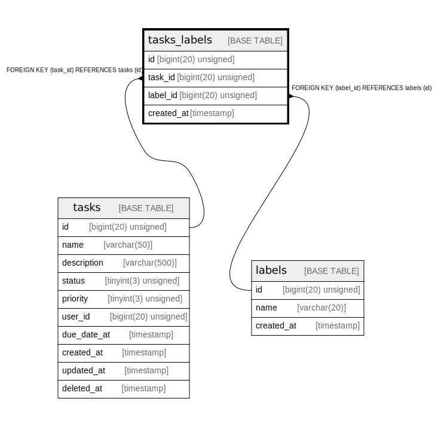

# tasks_labels

## Description

<details>
<summary><strong>Table Definition</strong></summary>

```sql
CREATE TABLE `tasks_labels` (
  `id` bigint(20) unsigned NOT NULL AUTO_INCREMENT,
  `task_id` bigint(20) unsigned NOT NULL,
  `label_id` bigint(20) unsigned NOT NULL,
  `created_at` timestamp NOT NULL DEFAULT CURRENT_TIMESTAMP,
  PRIMARY KEY (`id`),
  KEY `fk_task_id` (`task_id`),
  KEY `fk_label_id` (`label_id`),
  CONSTRAINT `fk_label_id` FOREIGN KEY (`label_id`) REFERENCES `labels` (`id`),
  CONSTRAINT `fk_task_id` FOREIGN KEY (`task_id`) REFERENCES `tasks` (`id`)
) ENGINE=InnoDB AUTO_INCREMENT=[Redacted by tbls] DEFAULT CHARSET=utf8mb4 COLLATE=utf8mb4_unicode_ci
```

</details>

## Columns

| Name | Type | Default | Nullable | Extra Definition | Children | Parents | Comment |
| ---- | ---- | ------- | -------- | ---------------- | -------- | ------- | ------- |
| id | bigint(20) unsigned |  | false | auto_increment |  |  |  |
| task_id | bigint(20) unsigned |  | false |  |  | [tasks](tasks.md) |  |
| label_id | bigint(20) unsigned |  | false |  |  | [labels](labels.md) |  |
| created_at | timestamp | CURRENT_TIMESTAMP | false |  |  |  |  |

## Constraints

| Name | Type | Definition |
| ---- | ---- | ---------- |
| fk_label_id | FOREIGN KEY | FOREIGN KEY (label_id) REFERENCES labels (id) |
| fk_task_id | FOREIGN KEY | FOREIGN KEY (task_id) REFERENCES tasks (id) |
| PRIMARY | PRIMARY KEY | PRIMARY KEY (id) |

## Indexes

| Name | Definition |
| ---- | ---------- |
| fk_label_id | KEY fk_label_id (label_id) USING BTREE |
| fk_task_id | KEY fk_task_id (task_id) USING BTREE |
| PRIMARY | PRIMARY KEY (id) USING BTREE |

## Relations



---

> Generated by [tbls](https://github.com/k1LoW/tbls)
