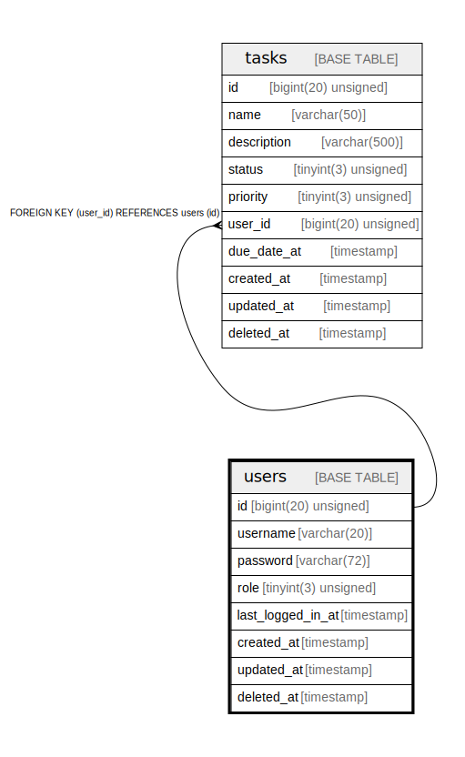

# users

## Description

<details>
<summary><strong>Table Definition</strong></summary>

```sql
CREATE TABLE `users` (
  `id` bigint(20) unsigned NOT NULL AUTO_INCREMENT,
  `username` varchar(20) COLLATE utf8mb4_unicode_ci NOT NULL DEFAULT '',
  `password` varchar(72) COLLATE utf8mb4_unicode_ci NOT NULL DEFAULT '',
  `role` tinyint(3) unsigned NOT NULL DEFAULT '0' COMMENT '0=normal, 1=admin',
  `last_logged_in_at` timestamp NULL DEFAULT NULL,
  `created_at` timestamp NOT NULL DEFAULT CURRENT_TIMESTAMP,
  `updated_at` timestamp NOT NULL DEFAULT CURRENT_TIMESTAMP ON UPDATE CURRENT_TIMESTAMP,
  `deleted_at` timestamp NULL DEFAULT NULL,
  PRIMARY KEY (`id`),
  UNIQUE KEY `username` (`username`)
) ENGINE=InnoDB AUTO_INCREMENT=[Redacted by tbls] DEFAULT CHARSET=utf8mb4 COLLATE=utf8mb4_unicode_ci
```

</details>

## Columns

| Name | Type | Default | Nullable | Extra Definition | Children | Parents | Comment |
| ---- | ---- | ------- | -------- | ---------------- | -------- | ------- | ------- |
| id | bigint(20) unsigned |  | false | auto_increment | [tasks](tasks.md) |  |  |
| username | varchar(20) |  | false |  |  |  |  |
| password | varchar(72) |  | false |  |  |  |  |
| role | tinyint(3) unsigned | 0 | false |  |  |  | 0=normal, 1=admin |
| last_logged_in_at | timestamp |  | true |  |  |  |  |
| created_at | timestamp | CURRENT_TIMESTAMP | false |  |  |  |  |
| updated_at | timestamp | CURRENT_TIMESTAMP | false | on update CURRENT_TIMESTAMP |  |  |  |
| deleted_at | timestamp |  | true |  |  |  |  |

## Constraints

| Name | Type | Definition |
| ---- | ---- | ---------- |
| PRIMARY | PRIMARY KEY | PRIMARY KEY (id) |
| username | UNIQUE | UNIQUE KEY username (username) |

## Indexes

| Name | Definition |
| ---- | ---------- |
| PRIMARY | PRIMARY KEY (id) USING BTREE |
| username | UNIQUE KEY username (username) USING BTREE |

## Relations



---

> Generated by [tbls](https://github.com/k1LoW/tbls)
