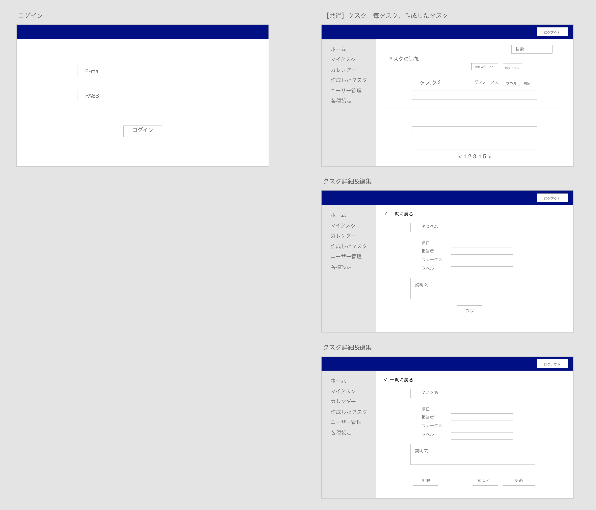
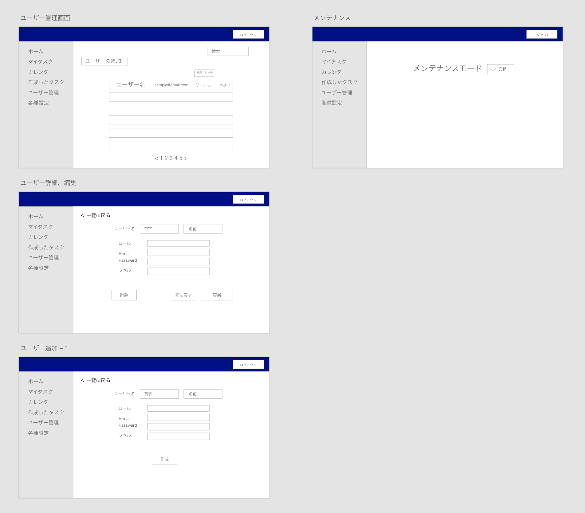
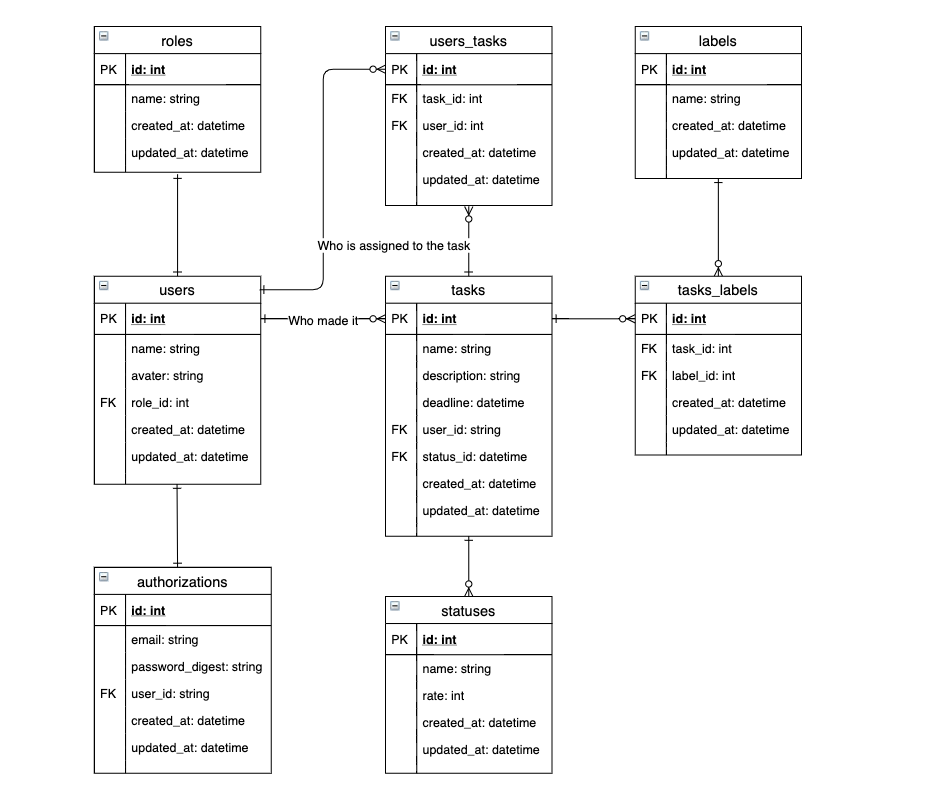

# Rails研修課題アプリ:neko

* Ruby version: 2.7.1
* Rails version: 6.0.2.2
* Mysql version: 5.6

## 画面遷移図
以下画像は[Adobe_XDで作成したプロトタイプ](https://xd.adobe.com/view/21c0eada-c16b-4efc-477f-39e5affc1df6-57f1/)から

## データベース
